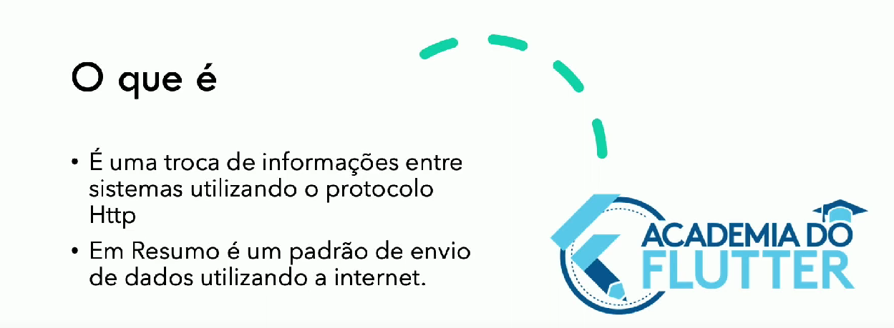
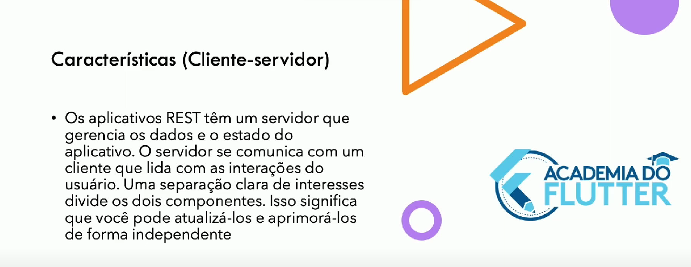
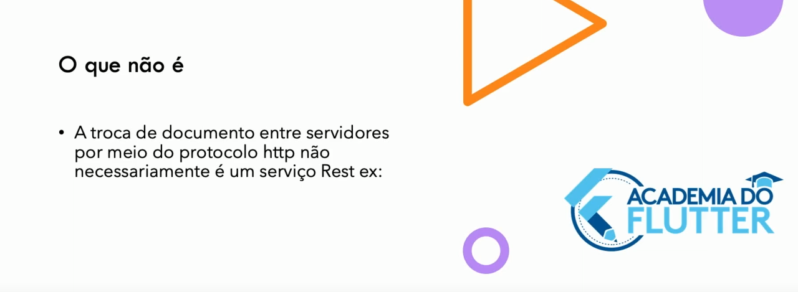
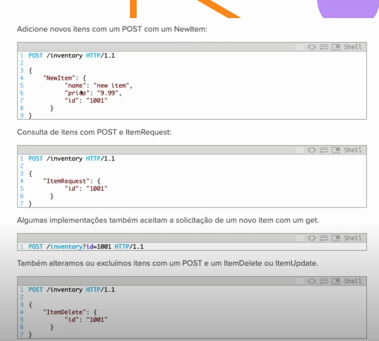
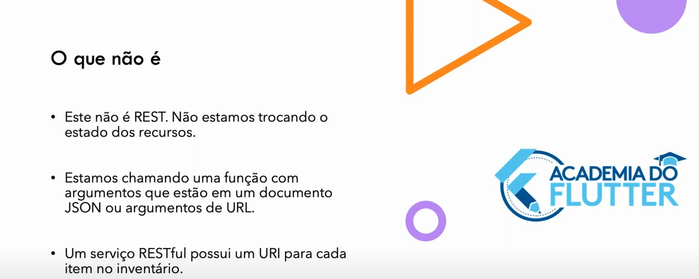
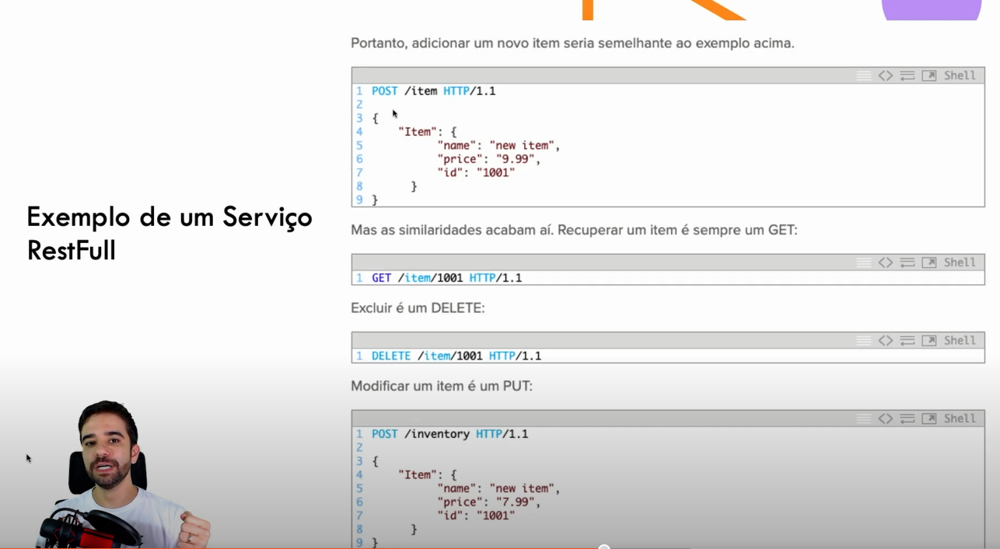
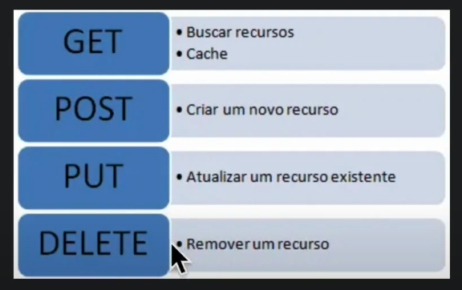
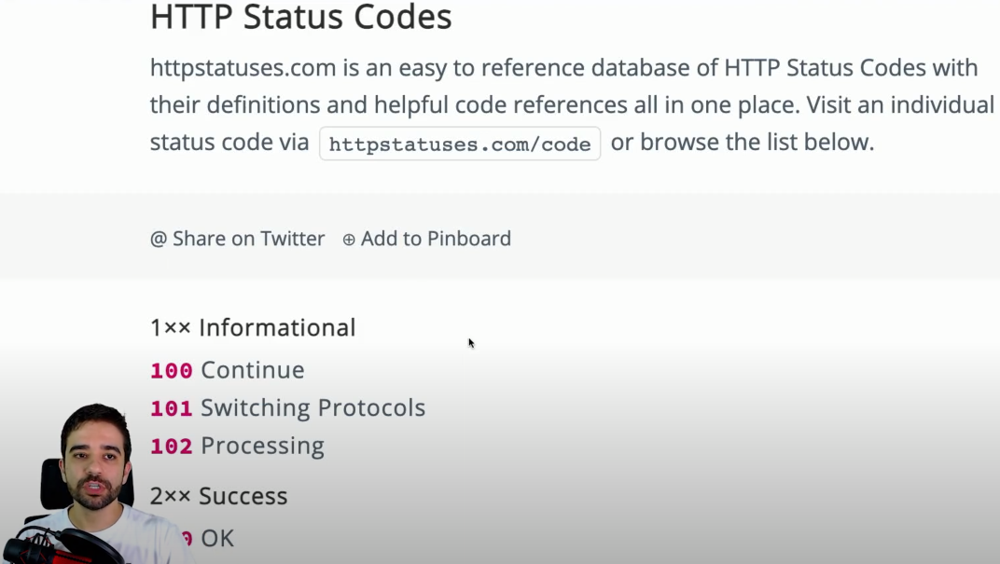

<h1 align="center">ATIVIDADES DESENVOLVIDAS NO CURSO DA ACADEMIA DO FLUTTER</h1>

 MÓDULO DART ASYNC.

  

### » Tópicos estudados e consolidados

- Função Sícrona 
  
  >Faz com que o sistema aguarde a execução de tudo que estiver dentro dela, para só depois continuar executando o restante das ações.
- Função Assíncrona
  >É uma função que o sistema executa, mas não espera seu término, e continua fazendo o que precisa.
- Palavras chaves:
  - async
      > Indica que a função é assíncrona e em algum momento talvez seja preciso esperar para pegar algum dado.
  - future
      > Essa função vai retornar um dado do futuro.
      > Quando você usa funções assíncronas, você utiliza o Future para indicar que aquela função é assíncrona, ou melhor, que ela vai retornar um valor no "futuro", como por exemplo: SUCESSO ou ERRO após 5 segundos.
  - await
      > Espera o término da função.
      > Você utiliza o await quando faz chamadas que retornem um Future. Isso faz com que o sistema espere a chamada da função assíncrona terminar para que execute o resto das coisas.
  - then
      > Execute essa chamada quando a função assíncrona terminar.
      > Você utiliza o then quando faz chamadas que retornem um Future, mas não quer esperar seu resultado .
      > Dessa forma, todo o código continuará sendo executado enquanto a função assíncrona é executada também.
- Future com foreach: Retornando processos simultaneos em paralelos.

- Dart e o Evento Loop 
  >   Para melhor compreensão desse assunto recomendo a leitura desse artigo https://dart.cn/articles/archive/event-loop

- Rest e Restfull
  

>>>
>>>
>>>
>>>
>>>
>>>
>>>
>>>
>>>
>>>
>>>

- Utilizando pacote http;
- Utilizando api ViaCep;
- Utilizando os métodos: GET, POS, PUT e DELETE;
- Criando classe modelos;

### Autor

